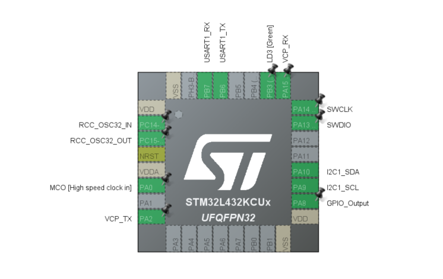

# Quick Setup

Configure a Nucleo-L432KC project with FreeRTOS and interrupt-driven USART1 echo on PA8 (relay), I²C reserved for INA219.



1. **Create project**
   STM32CubeIDE → New STM32 Project → Nucleo-L432KC → Finish

2. **PA8 as relay GPIO**
   Pinout: PA8 → GPIO\_Output

3. **I²C1 for INA219**
   Pinout: PA9 = SCL, PA10 = SDA → I2C1

4. **USART1 Async**
   Pinout: PB6 = TX, PB7 = RX → USART1 Asynchronous

5. **Enable FreeRTOS (CMSIS V2)**
   Middleware → FreeRTOS → CMSIS V2 → Generate Code

6. **USART1 NVIC**
   System Core → NVIC → Add `USART1 global interrupt`
   Preempt Priority = 6, Sub = 0
   (6 = `configLIBRARY_MAX_SYSCALL_INTERRUPT_PRIORITY + 1`)

7. **HAL timebase**
   System Core → SYS → Timebase source Msp = TIM6

8. **C library reentrancy**
   FreeRTOS → Advanced Settings → check **USE\_NEWLIB\_REENTRANT**

9. **Minimal test code** (`main.c`)

```c
   Task init:
   static uint8\_t rx;
   HAL\_UART\_Receive\_IT(\&huart1, \&rx, 1);
   for (;;) { osDelay(1); }

   Rx callback:
   void HAL\_UART\_RxCpltCallback(UART\_HandleTypeDef\* h) {
   if (h->Instance == USART1) {
   HAL\_GPIO\_TogglePin(GPIOA, GPIO\_PIN\_8);  // relay blink
   HAL\_UART\_Transmit\_IT(\&huart1, \&rx, 1); // echo
   HAL\_UART\_Receive\_IT(\&huart1, \&rx, 1);  // re-arm
   }
   }
```

Flash and run: the relay on PA8 toggles and each received byte is echoed back.
