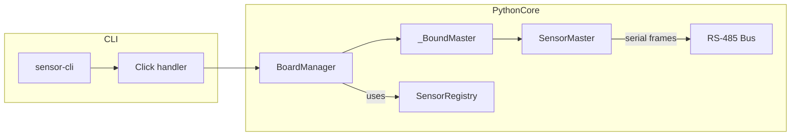

# Architecture Overview

This document outlines the key modules, data flows, and RTOS task structure of the STM32 I²C Sensor Hub (UART-only, RS-485 compatible binary protocol).

---

## 1. High-Level Block Diagram

```mermaid
flowchart LR
  subgraph Host - PC
    direction TB
    PC["Python script"]
  end

  subgraph MCU - STM32
    direction TB
    CmdTask["defaultTask<br>(UART1/RS-485 cmd handler)"]
    SensorMgr["SensorManager<br>(add/remove, config, get)"]
    subgraph I2C_Bus["Shared I²C Bus (busMutex)"]
      direction TB
      INA219["INA219 Driver"]
      Other["…other drivers"]
    end
  end

  PC ---|RS-485 UART1| CmdTask
  CmdTask -->|SensorManager API| SensorMgr
  SensorMgr -->|I²C ops| I2C_Bus
````

---

## 2. FreeRTOS Task Table

| Task Name       | Priority    | Stack (words) | Activation             | Responsibility                                                                                     |
| :-------------- | :---------- | :-----------: | :--------------------- | :------------------------------------------------------------------------------------------------- |
| `SensorTask[i]` | BelowNormal |      512      | Periodic (`period_ms`) | Read its sensor via I²C under `busMutex`, cache `SensorData_t`                                     |
| `defaultTask`   | Normal      |      128      | UART1 RX interrupt     | Wait for SOF byte, collect 6-byte commands, verify checksum, dispatch to SensorManager; toggle LED |

> **Tip:** call `uxTaskGetStackHighWaterMark()` in each task to verify stack use.

---

## 3. Data-Flow Sequence

```mermaid
sequenceDiagram
    participant H as UART Host
    participant DT as defaultTask
    participant SM as SensorManager
    participant ST as SensorTask[i]
    participant I2C as I²C Bus

    H->>DT: send [SOF,boardID,addr7,cmd,parm,csum]
    DT->>DT: detect SOF & verify checksum
    DT->>SM: invoke API (add/remove/read/etc.)
    SM-->>DT: return status or data

    alt READ command
      DT->>ST: SensorTask_GetData(addr7)
      ST-->>DT: SensorData_t
      DT-->>H: send [SOF,boardID,addr7,cmd,0x00,0x06,<6-byte>,csum]
    else other commands
      DT-->>H: send [SOF,boardID,addr7,cmd,status,0x00,csum]
    end

    Note over ST,I2C: SensorTask wakes every period_ms<br>and performs I²C read under busMutex
```

---

## 4. UART/RS-485 Packet Formats

### Command (6 bytes)

| Byte | Meaning                                                                                  |
| :--- | :--------------------------------------------------------------------------------------- |
| 0    | **SOF** (start-of-frame, e.g. `0xAA`)                                                    |
| 1    | **BoardID** (node’s ID, e.g. `0x01`)                                                |
| 2    | **addr7** (I²C sensor address, `0x01–0x7F`)                                              |
| 3    | **cmd** (0=READ,1=ADD,2=REMOVE,3=SET-PERIOD,4=SET-MASK,5=SET-GAIN,6=SET-RANGE,7=SET-CAL) |
| 4    | **param** (period units, mask, etc.)                                                     |
| 5    | **checksum** = XOR of bytes 1–4 (`boardID^addr7^cmd^param`)                              |

### Response (6+N bytes)

| Byte | Meaning                                                                |
| :--- | :--------------------------------------------------------------------- |
| 0    | **SOF** (e.g. `0xAA`)                                                  |
| 1    | **BoardID**                                                            |
| 2    | **addr7**                                                              |
| 3    | **cmd**                                                                |
| 4    | **status** (0=OK,1=ERROR,…)             |
| 5    | **length** (number of payload bytes, `0` for no payload)               |
| 6…   | **payload** (N bytes; e.g. for READ: 2B `voltage_mV`, 4B `current_uA`) |
| last | **checksum** = XOR of bytes 1–(5+N)                                    |

* The **SOF** byte lets the slave ignore noise and only start decoding when it sees a known marker.
* Using XOR for checksum catches single-bit and simple multi-bit errors with minimal overhead.

---

With this RS-485-ready framing, multiple STM32 nodes can share the same bus, each keyed by `BoardID`, and the host script simply toggles DE/RE and sends these frames.

## 5. Python Master Tools (CLI)

A **Python** layer under `master/` provides:

* **`BoardManager`** → scans boards, returns a **`_BoundMaster`** for per-board calls
* **`SensorMaster`** → low-level framing, checksum, serial I/O
* **`SensorRegistry`** → loads sensor metadata (names, type-codes, payload schemas)
* A **Click-based CLI** (`sensor-cli`) driving everything


