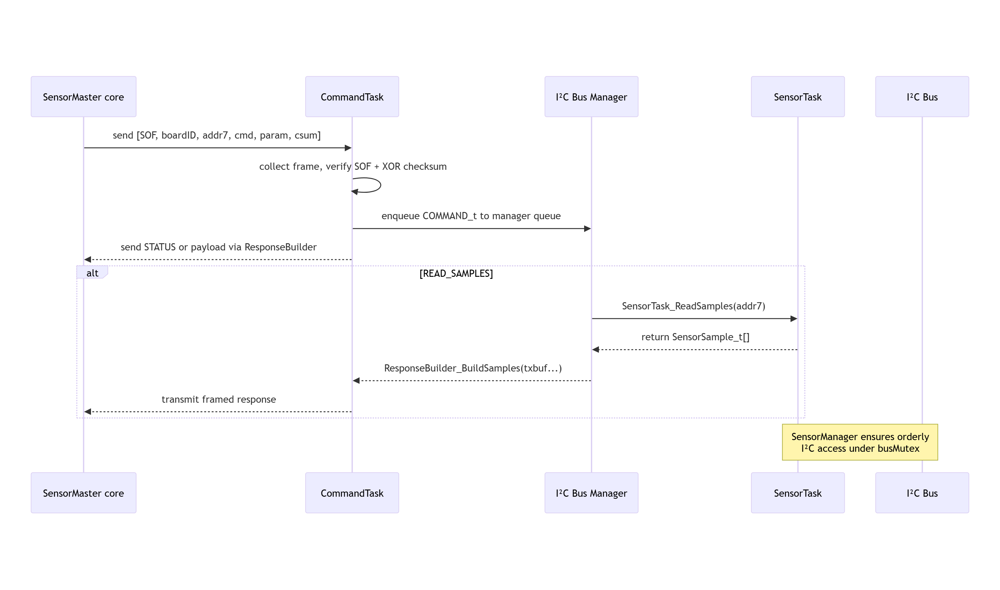

# Architecture Overview

This document outlines the key modules, data flows, and RTOS task structure of the STM32 I²C Sensor Hub firmware and its integration with the Python master tool.

---

## 1. High-Level Block Diagram

Commands arrive framed over RS-485 into the CommandTask, get dispatched to the I²C Bus Manager, which controls SensorTasks for periodic sampling and reports status via the debug console.

---

## 2. FreeRTOS Task Table

| Task Name       | Purpose                                         | Priority    | Stack (bytes) | Activation             |
| :-------------- | :---------------------------------------------- | :---------- | :-----------: | :--------------------- |
| `CommandTask`   | UART/RS-485 frame parsing, checksum, dispatch   | Normal      |    192 × 4    | on UART1 RX interrupts |
| `SensorTask[i]` | Periodic I²C reads, enqueue samples             | BelowNormal |    128 × 4    | periodic (`period_ms`) |
| `DefaultTask`   | Debug: print heap & stack watermarks via USART2 | Normal      |    128 × 4    | periodic (1s)          |

* **Tip:** Use `uxTaskGetStackHighWaterMark()` and `xPortGetFreeHeapSize()` in debug builds to monitor resource usage.
* **Note:** The default heap size is set via `configTOTAL_HEAP_SIZE` (e.g. 8192 bytes) in `FreeRTOSConfig.h`, which limits the number of sensor tasks.

---

## 3. Data-Flow Sequence

---

## 4. Python CLI (Master)

For end-to-end testing and control, see the [CLI documentation](docs/05-master-tools.md).

The SensorMaster core library can support multiple frontends: CLI, GUI, or web-based interfaces.

**Functionality**:

* **Board discovery**: `scan`, `boards`, `ping`
* **Sensor management**: `add`, `rmv`, `list`, `sensors`, `period`
* **Data retrieval & config**: `read`, `gain`, `range`, `calib`
* **Interactive mode**: `session`

---

[Home](index.md) • [Return (Overview)](project-overview.md) • [Next (Protocol)](protocol.md)

